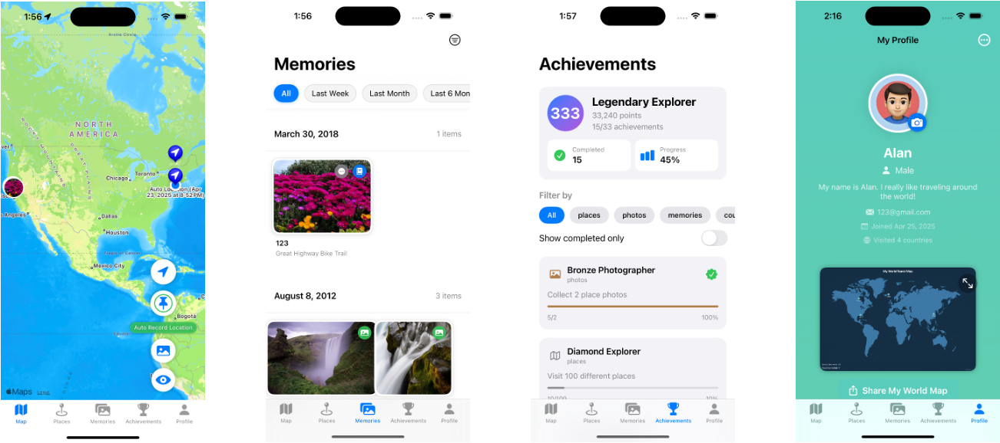

# MappaVita – A Travel Journal App to record your journal

## Screenshots

<div align="center">
  
</div>

<div align="center">
  
</div>

## Problem Statement:

Traveling is an enriching experience in my life, but over time, it becomes difficult to remember all the places we have visited, the memories we have made, and the stories behind the each location. So I want to make an application to interactive visualization of travel history and location-based memory with photos.

## Functions

| Feature Module                          | Details                                                                                                                                                                                                                                                                                                  |
| --------------------------------------- | -------------------------------------------------------------------------------------------------------------------------------------------------------------------------------------------------------------------------------------------------------------------------------------------------------- |
| **Automatic Location Recording**        | - Continuously track and record user's GPS location in real-time.- Support background location updates.- Optimize for battery consumption by setting appropriate distance filters.- Only record new locations when the user moves beyond a minimum distance threshold (e.g., 50 meters).                 |
| **Automatic Import of Photo Locations** | - Automatically scan user's photo library to extract location metadata (GPS tags).- Highlight locations from photos on the interactive map.- Handle missing GPS data gracefully (some images may lack location info).- Request proper photo library permissions and manage large photo sets efficiently. |
| **Manual Place Addition**               | - Allow users to manually add places they've visited.- Enable users to take a photo or pick one from the photo library.- Allow editing of place details: name, description, visit date.- Use reverse geocoding (CLGeocoder) to automatically fetch place names from coordinates.                         |
| **Travel History Visualization on Map** | - Display all recorded and added places on an interactive map (MapKit).- Support tapping on a map annotation to view detailed information.- Implement clustering (MKClusterAnnotation) when many places are close together to maintain performance and clarity.                                          |
| **Place Statistics & Achievements**     | - Track and display user's travel statistics: - Number of countries/regions visited - Longest distance traveled - Most frequently visited places - Consecutive travel days- Unlock badges and achievements based on travel milestones.                                                                   |
| **Memories (Photos and Journals)**      | - Attach multiple photos to each place.- Allow users to write journal entries or notes for each place.- Support rich text or basic Markdown formatting.- Enable users to browse, edit, and delete place memories.                                                                                        |
| **Share and Export Travel Records**     | - Share individual places (photos, notes, location) to social media or other apps via iOS Share Sheet.- Export a snapshot of the travel map highlighting visited places.- Allow users to choose between sharing a single place or an entire trip overview.                                               |

## App UI Structure

1. SplashScreen
2. LoginView/SignUpView
3. After Login
   1. MapView
   2. PlacesView
   3. MemoriesView
   4. AchievementsView
   5. ProfileView

## App Flow:

SplashScreen
↓
Onboarding Screens
↓
LoginView / SignUpView
↓
Forgot Password (optional from login screen)
↓
Main Tab Bar
↓
MapView
PlacesView
MemoriesView
AchievementsView
ProfileView (settings, logout, manage permissions)

## App Structure

```swift
MappaVitaApp/
│
├── Core/                    # Core services and managers (location, sync)
│   ├── LocationManager.swift
│   ├── PhotoLocationManager.swift
│   ├── AuthManager.swift
│   ├── CloudSyncManager.swift (optional)
│
├── Models/                   # Data models
│   ├── Place.swift
│   ├── Photo.swift
│   ├── Memory.swift
│   ├── Achievement.swift
│   ├── User.swift
│
├── Views/                    # All interfaces
│   ├── SplashScreen/
│   │   ├── SplashView.swift
│   ├── Onboarding/
│   │   ├── OnboardingView.swift
│   ├── Authentication/
│   │   ├── LoginView.swift
│   │   ├── SignUpView.swift
│   │   ├── ForgotPasswordView.swift
│   ├── MainTab/
│   │   ├── MainTabView.swift  # TabView + Navigation
│   │   ├── MapView/
│   │   │   ├── MapScreen.swift
│   │   │   ├── PlaceAnnotation.swift
│   │   ├── PlacesView/
│   │   │   ├── PlacesListView.swift
│   │   │   ├── PlaceDetailView.swift
│   │   ├── MemoriesView/
│   │   │   ├── MemoriesListView.swift
│   │   │   ├── MemoryDetailView.swift
│   │   ├── AchievementsView/
│   │   │   ├── AchievementsView.swift
│   │   ├── ProfileView/
│   │   │   ├── ProfileView.swift
│   │   │   ├── SettingsView.swift
│
├── ViewModels/               # Logic for each interface (MVVM)
│   ├── SplashViewModel.swift
│   ├── OnboardingViewModel.swift
│   ├── AuthViewModel.swift
│   ├── MapViewModel.swift
│   ├── PlacesViewModel.swift
│   ├── MemoriesViewModel.swift
│   ├── AchievementsViewModel.swift
│   ├── ProfileViewModel.swift
│
├── Services/                 # Firebase/Storage/Networking abstractions
│   ├── FirebaseService.swift
│   ├── StorageService.swift
│   ├── GeoCodingService.swift
│
├── Utilities/                # Utility classes
│   ├── Extensions/
│   │   ├── UIImage+Resize.swift
│   │   ├── CLLocation+Distance.swift
│   │   ├── Constants.swift
│   │   ├── Helpers.swift
│
├── Resources/                # Static resources
│   ├── Assets.xcassets
│   ├── Localization/         # For multi-language support
│
├── MappaVitaApp.swift         # App entry point
│
└── Info.plist

```
